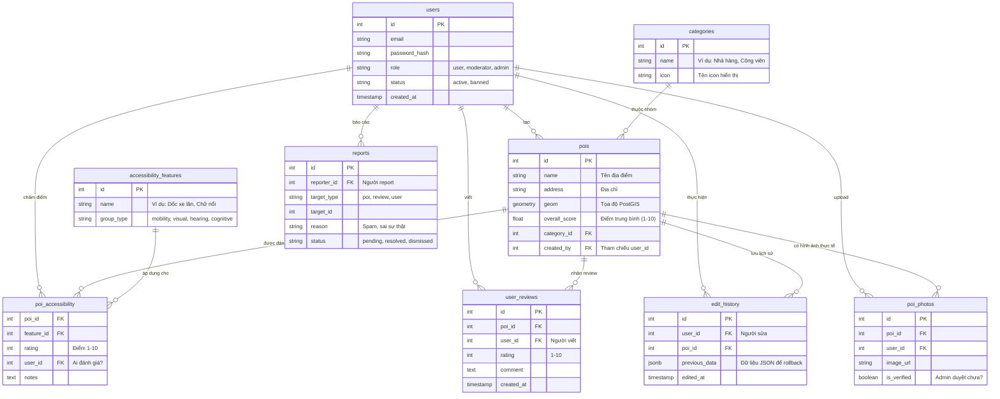
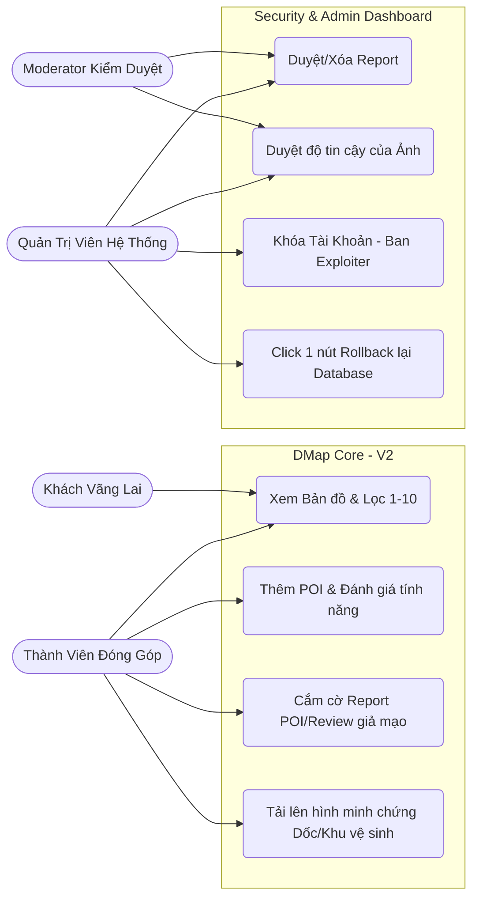

# V2 Planning: Security, Auth & Moderation

> Tài liệu này được chuẩn bị bởi Senior Project Manager, mô tả Sơ đồ Cơ sở dữ liệu (ERD) và Use Case cho giai đoạn V2. Mục tiêu tối thượng của V2 là Bảo mật, Phân quyền (Roles) và Chống Phá Hoại (Exploiter Defense).

## 1. V2 Entity Relationship Diagram (ERD)

Mở rộng cấu trúc gốc (PostGIS) bằng việc gắn thêm vòng bảo vệ Auth, Kiểm duyệt (Moderation) và lưu Log Server (Audit).

## 2. V2 Use Case Diagram (Roles & Moderation)

Sơ đồ phân quyền tương tác, thiết lập hệ thống Tường lửa Bảo vệ Dữ liệu (Moderation & Rollback) để ngăn chặn Exploiter tạo Rác/Spam Tọa Độ.

## 3. Kiến Trúc Chống Phá Hoại (Anti-Exploit Architecture)
1. **Khách vãng lai** chỉ được xem bản đồ, đọc review, và sử dụng thanh Toolbar tiếp cận (Zoom Font, High Contrast).
2. **Thành viên đóng góp** phải được xác thực (Login/Auth) mới được cắm Marker mới lên PostGIS, chấm điểm (Rating) và đăng ảnh.
3. Khi xảy ra hành vi **Spam Bot / Phá Hoại (Kéo tool xả tọa độ sai/rác)**: Các User thường sẽ dùng luồng báo cáo sai phạm `reports`.
4. **Moderator / Admin** lập tức khóa mõm (Ban User) những tài khoản này. Sau đó, thay vì Server nổ tung, Admin sử dụng bảng `edit_history` (Audit Log chứa toàn bộ log API theo dạng Json) tải lại phiên bản DMap "5 phút trước vụ phá hoại" cực kỳ mượt mà.
